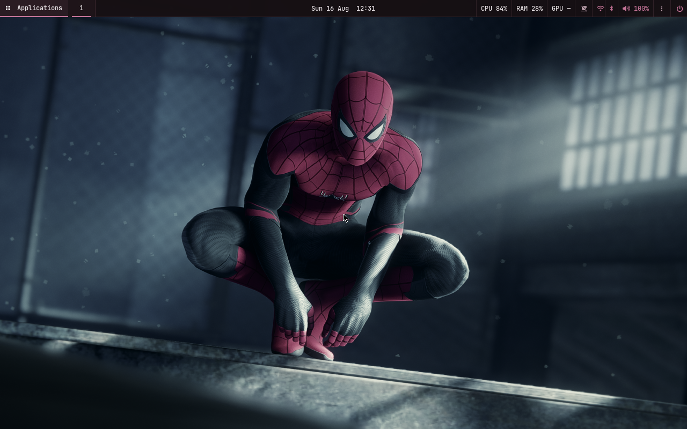
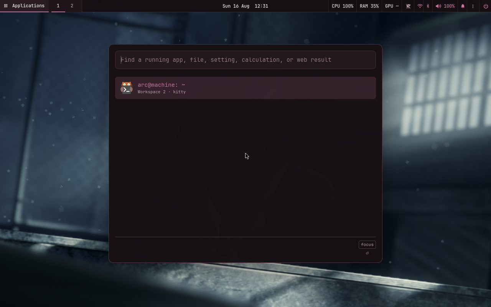
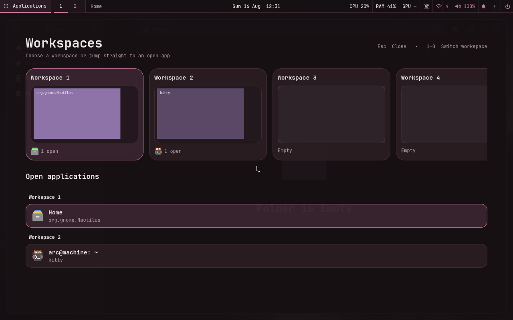
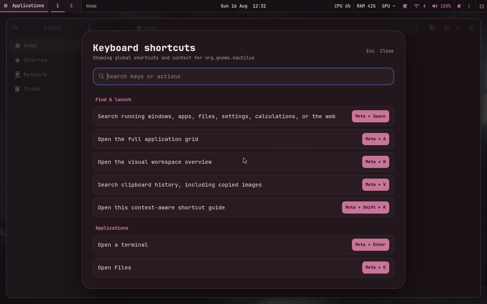
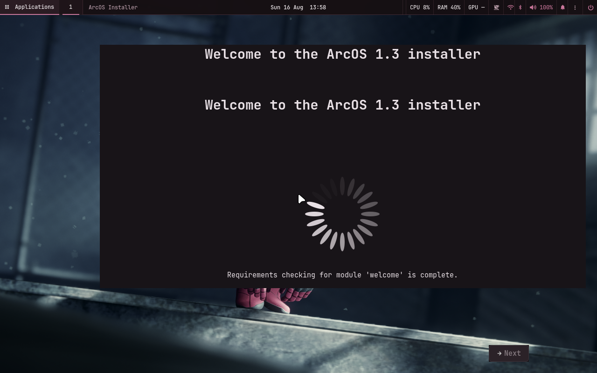

# ArcOS dotfiles

The complete ArcOS v1.3 SwayFX rice: reproducible NixOS modules, native desktop
surfaces, wallpaper-derived theme templates, scripts, terminal tooling, and
ordinary user-facing dotfiles.



These are the files used by the real
[ArcOS](https://github.com/abhinavpathak9873/arcos) workstation image, not a
separate approximation of the design.

## Layout

```text
.
├── .config/                 Familiar user-facing dotfiles
│   ├── arcos-desktop/       Source templates rendered from the wallpaper
│   ├── kitty/               Terminal and generated palette include
│   ├── nvim/                Minimal Lua setup and generated palette
│   ├── rofi/                Utility-menu configuration
│   ├── sway/config.d/       Safe personal compositor overrides
│   ├── swaync/ + swayosd/   Notifications, controls, and OSD
│   ├── tmux/                Status line and ArcOS palette
│   ├── walker/              Spotlight providers and UI
│   └── waybar/              Fixed top panel
├── assets/                  ArcOS marks and default wallpaper
├── config/                  Canonical templates consumed by Nix
├── crates/                  Native Arc components (disabled in desktop v1.3)
├── nix/                     Modules, hosts, hardware, packages, patches, tests
├── scripts/                 Theme, overview, lock, power, capture, and utilities
├── Cargo.toml + Cargo.lock  Native component workspace
└── flake.nix + flake.lock   Pinned NixOS 26.05 source
```

The Sway configuration is intentionally declared in
[`nix/modules/arcos.nix`](nix/modules/arcos.nix), where package paths and system
services stay reproducible. Put personal, non-Nix overrides in
`.config/sway/config.d/99-user.conf`; the system config includes that directory
last.

Files ending in `.template` contain ArcOS palette placeholders. The
`arcos-theme` utility renders them into the active files in
`~/.config/arcos-desktop` and the relevant application directories. Do not
replace those generated files with literal, unrendered templates.

## Use as a NixOS module

Add the flake as an input, then import the three desktop modules:

```nix
{
  inputs.arcos-dotfiles.url = "github:abhinavpathak9873/arcos-dotfiles";

  outputs = { nixpkgs, arcos-dotfiles, ... }: {
    nixosConfigurations.my-machine = nixpkgs.lib.nixosSystem {
      system = "x86_64-linux";
      modules = [
        arcos-dotfiles.nixosModules.default
        arcos-dotfiles.nixosModules.personalDesktop
        arcos-dotfiles.nixosModules.universalGpu
        ({ ... }: {
          services.arcos = {
            enable = true;
            enableAi = false;
            fullAppSuite = true;
            user = "your-user";
            autoLogin = false;
            enableHeadlessOutput = false;
            softwareRendering = false;
          };
        })
      ];
    };
  };
}
```

The importing configuration must also declare `users.users.your-user`.
`universalGpu` intentionally includes proprietary NVIDIA user space alongside
Mesa and therefore requires accepting those package licenses.

To inspect or build the exact workstation ISO instead:

```bash
nix build .#desktop-iso -L
```

## Theme control

```bash
arcos-theme auto                # derive a restrained palette from the wallpaper
arcos-theme color '#c9799f'     # choose an exact accent
arcos-wallpaper-picker          # choose wallpaper, then apply its palette
```

The palette coordinates SwayFX borders, Waybar, Walker, GTK, Kitty, tmux,
Neovim, SwayNC, SwayOSD, lock/power/shortcut surfaces, and OpenRGB.

## Core shortcuts

| Shortcut | Action |
| --- | --- |
| `Meta+Space` | Running windows first; apps, files, settings, math, units, currencies, web as you type |
| `Meta+A` | Categorized application grid |
| `Meta+W` | Workspace previews and grouped open applications |
| `Meta+V` | Text and image clipboard history |
| `Meta+Shift+K` | Search global and focused-app shortcuts |
| Hold `Caps Lock` | Local Voxtype dictation into the focused field |
| `Meta+Enter` | Kitty |
| `Meta+Shift+Enter` | Persistent tmux main session |
| `Meta+1…0` | Switch workspaces |
| `Meta+Shift+1…0` | Move the focused window to a workspace |
| `Meta+Arrow` | Move focus |
| `Meta+Shift+Arrow` | Move a window |
| `Meta+N` | Notifications and quick controls |
| `Meta+Escape` | Session and power surface |
| `Meta+Ctrl+L` | Same-wallpaper secure lock |

Open the complete, searchable map at any time with `Meta+Shift+K`.

## Visual evidence

| Spotlight | Workspace overview |
| --- | --- |
|  |  |





The desktop surfaces are generated by the ArcOS graphical NixOS/KVM test. The
installer frame comes from the exact release ISO after an OVMF/Q35 boot with a
writable virtual target disk.
